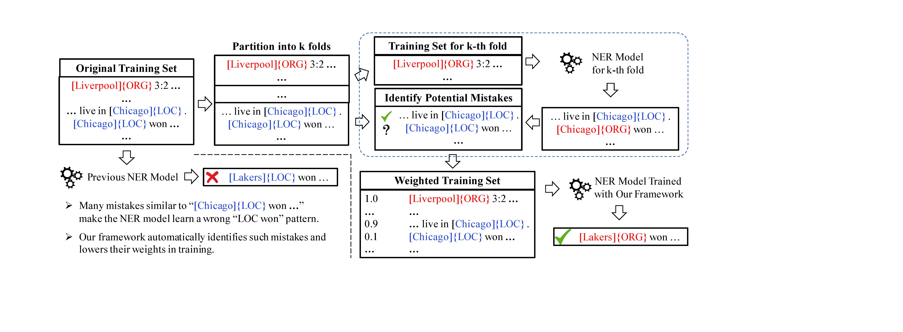

# CrossWeigh
<h1 align="center">CrossWeigh</h1>
<h5 align="center">CrossWeigh: Training Named Entity Tagger from Imperfect Annotations</h5>

## Motivation 

The label annotation mistakes by human annotators brings up two challenges to NER:  
- mistakes in the test set can interfere the evaluation results and even lead to an inaccurate assessment of model performance.
- mistakes in the training set can hurt NER model training. 

We address these two problems by:
- manually correcting the mistakes in the test set to form a cleaner benchmark.
- develop framework `CrossWeigh` to handle the mistakes in the training set. 
<p align="center"></p>

`CrossWeigh` works with any NER algorithm that accepts weighted training instances. It
is composed of two modules. 1) mistake estimation: where potential mistakes are identified in the training
data through a cross-checking process and 2) mistake re-weighing: where weights of those mistakes are lowered
during training the final NER model.

## Data
`/data/cor.eng.testb` folder is the manually corrected test set, there should be exactly 186 sentences that 
differ from the original test set. 

## Scripts
`split.py` can be used to generate a k-fold entity disjoint dataset from a list of datasets(usually both the train and development set)  
`flair_scripts/flair_ner.py` can be used to train a weighted version of flair.  
`collect.py` can be used to collect all the predictions on the k folded test set.  

## Steps to reproduce
Make sure you are in a python3.6+ environment.  
See [example.sh](example.sh) to reproduce the results.  
Using [Flair](https://github.com/zalandoresearch/flair) (non-pooled version), the final result should achieve
around 93.19F1 on the original test dataset and 94.18F1 on the corrected test set. Using Flair without CrossWeigh gives
around 92.9F1.  

## Results
All the results are averaged across 5 runs and standard deviation is reported.

| Model | w/o CrossWeigh (original) | w/ CrossWeigh (original) | w/o CrossWeigh (corrected) | w/ CrossWeigh (corrected) |
| --- | :-------------: | :-------------: | :-------------: | :-------------: |
| [VanillaNER](https://github.com/LiyuanLucasLiu/Vanilla_NER) | 91.44(±0.16) | **91.78**(±**0.06**) | 92.32(±0.16) | **92.64**(±**0.08**) |
| [Flair](https://github.com/zalandoresearch/flair) | 92.87(±**0.08**) | **93.19**(±0.09) | 93.89(±**0.06**) | **94.18**(±**0.06**) |
| [Pooled-Flair](https://github.com/zalandoresearch/flair) | 93.14(±0.14) | **93.43**(±**0.06**) | 94.13(±0.11) | **94.28**(±**0.05**) |
| [GCDT](https://github.com/Adaxry/GCDT) | 93.33(±0.14) | **93.43**(±**0.05**) | 94.58(±0.15) | **94.65**(±**0.06**) |
| [LSTM-CRF](https://github.com/glample/tagger) | 90.64(±0.23) | | 91.47(±0.15) | | 
| [LSTM-CNNs-CRF](https://github.com/XuezheMax/NeuroNLP2) | 90.65(±0.57) | | 91.87(±0.50) | | 
| [ELMo](https://github.com/allenai/allennlp/blob/master/tutorials/how_to/elmo.md) | 92.28(±0.19) | | 93.42(±0.15) | | 

For all models, we use their suggested parameter settings.  
For GCDT, we used the weights estimated from Pooled-Flair for efficiency purposes.

## Citation
Please cite the following paper if you found our dataset or framework useful. Thanks!

>Zihan Wang, Jingbo Shang, Liyuan Liu, Lihao Lu, Jiacheng Liu, and Jiawei Han. "CrossWeigh: Training Named Entity Tagger from Imperfect Annotations." arXiv preprint arXiv:1909.01441 (2019).

```
@article{wang2019cross,
  title={CrossWeigh: Training Named Entity Tagger from Imperfect Annotations},
  author={Wang, Zihan and Shang, Jingbo and Liu, Liyuan and Lu, Lihao and Liu, Jiacheng and Han, Jiawei},
  journal={arXiv preprint arXiv:1909.01441},
  year={2019}
}
```
